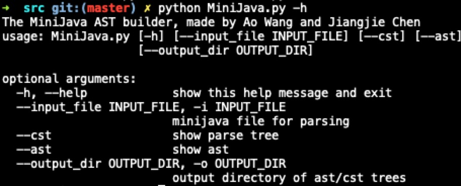

# Project_For_Compiler
The project for COMP130014 @ Fudan University

## Requirements

> Developing OS: MacOS 10.14
>
> - But it should support Linux and Windows, untested though.
>
> Python==3.6
>
> antlr4-python3-runtime==4.7.2
> 
> graphviz==0.10.1
> 
> pydot==1.4.1

```bash
brew install graphviz || sudo apt-get install graphviz
pip install -r requirements.txt
```

#### Recommended plugin

> PyCharm: ANTLR-V4 grammar plugin

## Usage

```bash
python MiniJava.py --cst --ast -i testfiles/xxx.java -o testfiles/output/
```



## Contribution

| Name           | Contribution                                  | Percentage |
| -------------- | --------------------------------------------- | ---------- |
| Chen, Jiangjie | 架构设计、词法/语法分析、文法文件、具体语法树       | 45%        |
| Wang, Ao       | 文件文法补充、语义分析、错误处理与修复、抽象语法树   | 55%        |
test
